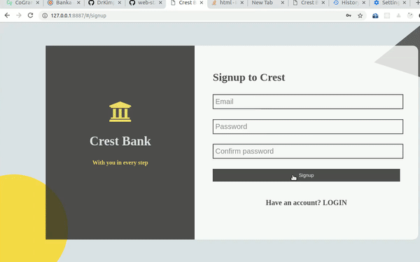

## Banka a light-weight core banking application

#### Demo



#### A working application can be found [here](https://drkimpatrick.github.io/Banka/UI/)

Banka is a light-weight core banking application that powers banking operations like account creation, customer deposit and withdrawals. This app is meant to support a single bank, where users can signup and create bank accounts online, but must visit the branch to withdraw or deposit money..

### Installation

- Clone this repository by running the command:

```bash
git clone https://github.com/DrKimpatrick/Banka.git
```

#### Starting the app

- After successfully cloning the project: `cd Banka`
- Open index.html with live server

## Features

- User (client) can sign up.
- User (client) can login.
- User (client) can create an account.
- User (client) can view account transaction history.
- User (client) can view a specific account transaction.
- Staff (cashier) can debit user (client) account.
- Staff (cashier) can credit user (client) account.
- Admin/staff can view all user accounts.
- Admin/staff can view a specific user account.
- Admin/staff can activate or deactivate an account.
- Admin/staff can delete a specific user account.
- Admin can create staff and admin user accounts.
